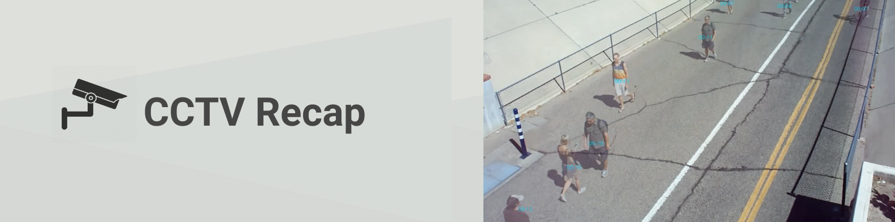
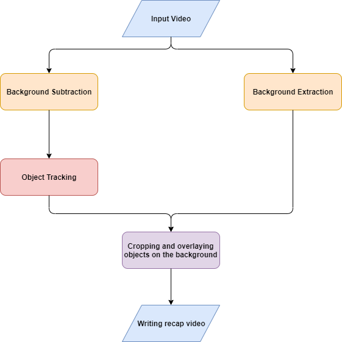
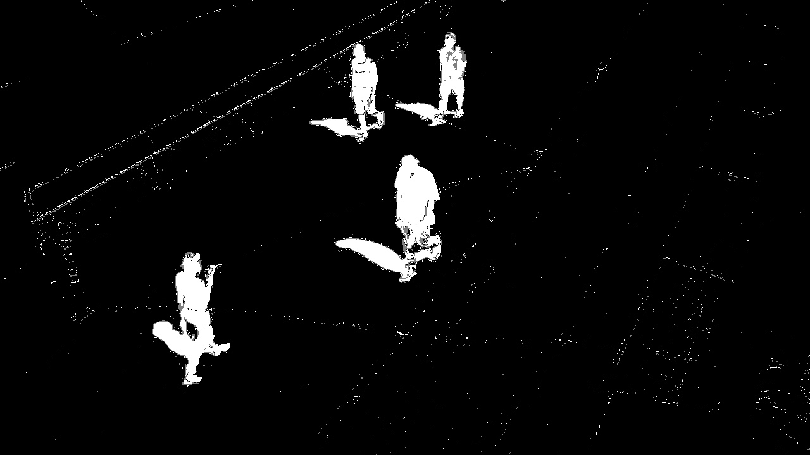
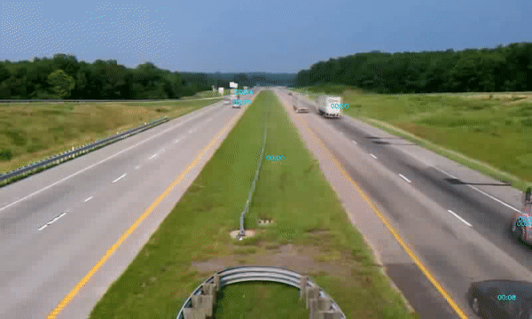

# CCTV Recap



>  Summarize hours of footage shot by static CCTV cameras into a short clip that shows all events as if they're occurring concurrently with timestamps as shown in the demo.

## Repository Layout

```text
src/cctv_recap/       Python recap engine, FastAPI API, and Gradio UI
frontend/             React + Vite dashboard
docs/assets/          Documentation images and demo GIFs
notebooks/            Research notebooks
samples/              Demo and codec sample videos
uploads/, results/    Runtime folders ignored by Git
```

## Problem

In the modern times of security, Surveillance cameras are making their way into the domestic markets as well. It becomes a very *tedious task* to go through tens of hours of footage to check for any suspicious activity in the area. It also takes a *lot of memory* to store these long videos, and sometimes the resolution of the video is *compromised* to save memory. There is a need for surveillance solutions that can abridge such long footage into short videos while still retaining important events.

## Solution

CCTV-Recap can summarize hours of footage shot by static CCTV cameras into a <u>short clip</u> that shows all interesting events simultaneously. The program identifies and tracks all moving objects present in the video and overlays these events on a single clip, while also showing the timestamps for each event, thus letting the user perform surveillance for multiple events.

<div align="center"></div>  

### Working

* ##### Background Extraction: 

  We use a moving average of all frames in the video to approximate the background. As disturbances don't often last throughout the duration of the video, only the background's pixel values are reflected in the final average.

* ##### Background Subtraction: 
  We use KNN-based background subtraction to identify movement/disturbance in the video and use contours to get bounding-boxes for each item on the background.

* ##### Object Tracking: 
  We custom-made an Object Tracking algorithm to associate/group these bounding boxes into individual *moving objects*.  We iterate over each frame and for every bounding-box found, we find the nearest, already-existing moving_object. If the found object and the box are both the nearest entities to each-other, they are associated/grouped into the same moving_object. If the box is left alone, it is created as a new moving_object. If a moving_object is left alone(for a few frames), we stop tracking that object for the rest of the video.

* ##### Cropping and overlaying moving objects: 
  A few filters are applied on the moving objects to refine the output. These objects are now cropped out of the original video and overlaid on the background simultaneously (irrespective of their starting time in the original video) to give an appearance of all these events happening at the same time. Each event's time of occurrence is displayed on top of its moving object. The events are given a slight transparent appearance to deal with overlaps between multiple objects.



## Challenges Faced

* **Overlapping of multiple objects:** One of the earliest problems we came across was that of multiple objects of different timelines overlapping with each other. We tried delaying the overlapping objects by some duration but that didn't cover all the cases. We ended up giving the moving objects an opacity of 0.5 so that overlapping objects didn't obstruct each other and since they're translucent, one was visible behind the other.
* **Object tracking:** Background subtraction only gives us boxes around people/things in *each frame*. Object tracking is the task of associating/grouping the boxes across multiple frames together. The object tracking solutions already implemented online were not in line with our purpose of usage, so we had to custom-implement an object tracking algorithm ourselves, the working of which is described [above](#object-tracking).

## Setup

This repository now includes a full-stack CCTV Recap platform with:

* a Python backend API for video ingestion and AI recap generation
* a premium React + Tailwind frontend for upload, preview, and live status

### Python backend

* Install dependencies

  ```bash
  pip install -r requirements.txt
  ```

* Run the backend API

  ```bash
  python -m uvicorn cctv_recap.api:app --reload --host 127.0.0.1 --port 8000
  ```

  If you are running directly from the source tree without installing the package, set `PYTHONPATH=src` first.

### Frontend

* Open a new terminal and install frontend dependencies

  ```bash
  cd frontend
  npm install
  ```

* Start the development UI

  ```bash
  npm run dev -- --host 0.0.0.0 --port 4173
  ```

* Open the dashboard in your browser:

  ```text
  http://localhost:4173/
  ```

### Direct command-line use

If you want to run the video summarization engine directly from Python:

```bash
python -m cctv_recap <path to video> --interval 10 --min-duration 4
```

After editable install, the same command is available as:

```bash
cctv-recap <path to video> --interval 10 --min-duration 4
```

## Results


